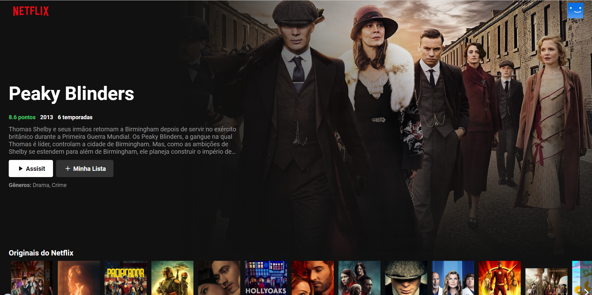

<h1 align="center"> Clone Pagina inicial da Netflix </h1>

<div align="center">
    
</div>

## Descrição

O projeto é um clone da pagina inicial da Netflix (é uma provedora global de filmes e séries de televisão via streaming sediada em Los Gatos, Califórnia) feita com a biblioteca React. Para trazer os dados dos filmes foi usado a API do TMDB que retorna uma lista completa dos filmes e series, o clone esta baseado na versão antiga da netflix. Para o desenvolvimento desse projeto foi seguido um tutorial de base do professor Bonieky Lacerda, que você pode conferir na seção "Agradecimentos Especiais".


## Instalação Local

Para executar esse projeto você precisara do [Node](https://nodejs.org/en/).

Por meio dele sera baixado todas as depedencias do projeto, depois de instalado execute os comandos abaixo na linha do terminal.

1) para baixa todas as dependencias do projeto

```bash  
npm install
```

5) Execute o comando abaixo no terminal
```bash 
npm start
```


## Status do Projeto

**Concluido**: O projeto esta terminado, não havera futuras alterações de funcionalidade.


## Construído com

* [React](https://pt-br.reactjs.org/) - O React é uma biblioteca JavaScript de código aberto com foco em criar interfaces de usuário em páginas web. É mantido pelo Facebook, Instagram, outras empresas e uma comunidade de desenvolvedores individuais. É utilizado nos sites da Netflix, Imgur, Feedly, Airbnb, SeatGeek, HelloSign, Walmart e outros. .

## Versão das Linguagens e Ferramentas

#### Geral

* React: 17.0.2

## Autor

* **Cesar dos Santos de Almeida** - *responsável pela construção e desenvolvimento do projeto*

## Licença

Este projeto está licenciado sob a licença MIT - consulte o arquivo [LICENSE.md](LICENSE.md) para obter detalhes


## Links

* [Demo](https://happy-wiles-89dc0f.netlify.app/) - Link de demonstração


## Agradecimentos Especiais

* [Bonieky Lacerda](https://www.youtube.com/watch?v=tBweoUiMsDg) - Link do video


